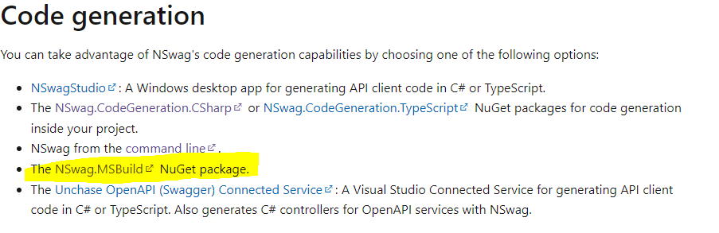

# msbuild-customtask

The goal is to test and explore possibilities around the msbuild custom task generation.  
Basic idea:

```
Input text => Generation => Output C# (Some code generation)
```

Explore possible stories

## Custom Task Example

### Projects

- CustomTask, it is the msbuild task.  
  It receive as input a text file, each line has the format:

```
propertyName:type:defaultValue
```

Then a class with that constants is generated.

- BuildConsoleExample, it is the project which use the new custom task.

### How to test

1. Build CustomTask project (AppSettingStronglyTyped is the new task)
1. Build BuildConsoleExample project (Console app, which use AppSettingStronglyTyped)  
   It has the file _Properties.mysettings_  
   Then a build or rebuild generates _MySetting.generated.cs_

```xml
  <PropertyGroup>
	   <OutputType>Exe</OutputType>
		<TargetFramework>net5.0</TargetFramework>
		<RootFolder>.</RootFolder>
		<SettingClass>MySetting</SettingClass>
		<SettingNamespace>BuildConsoleExample</SettingNamespace>
  </PropertyGroup>
  <ItemGroup>
	 <SettingFiles Include="$(RootFolder)\*.mysettings" />
  </ItemGroup>
  <Target Name="GenerateSetting" BeforeTargets="CoreCompile" Inputs="@(SettingFiles)" Outputs="$(RootFolder)\$(SettingClass).generated.cs">
		<AppSettingStronglyTyped SettingClassName="$(SettingClass)" SettingNamespaceName="$(SettingNamespace)" SettingFiles="@(SettingFiles)">
			<Output TaskParameter="ClassNameFile" PropertyName="SettingClassFileName" />
		</AppSettingStronglyTyped>
		<ItemGroup>
			<Compile Remove="$(SettingClassFileName)" />
			<Compile Include="$(SettingClassFileName)" />
		</ItemGroup>
	</Target>
	<Target Name="ForceReGenerateOnRebuild" AfterTargets="CoreClean">
		<Delete Files="$(RootFolder)\$(SettingClass).generated.cs" />
	</Target>
```

1. It can be executed by

```dotnetcli
# Build or rebuild the solution with Visual Studio

# On BuildConsoleExample\BuildConsoleExample (-bl binary log)
dotnet build -bl (run core environment)
# or
msbuild -bl (run on net framework environment, this is used by Visual Studio)
#it will generate a log  msbuild.binlog, and it can be open with https://msbuildlog.com/
```

**Considerations**

You can delete MySetting.generated.cs, it will be regenerated

The files is using incremental build, it is only regenerated only if

1. The document doesn't exist
2. The timestamp of the input file is newer than the output

The rebuild regenerates, it is because the file is deleted after CoreClean (before the build). The clean delete also the generated file.

### Define Scenario

#### Apache Thrift

[Apache Thrift](https://thrift.apache.org/) allows you to define data types and service interfaces in a simple definition file. Taking that file as input, the compiler generates code to be used to **easily build RPC clients and servers** that communicate seamlessly across programming languages. Instead of writing a load of boilerplate code to serialize and transport your objects and invoke remote methods, you can get right down to business.

- I don't like to use in the example a non Microsoft library, when there are Microsoft posibilities

**REST API client**

This is so much common scenario and there are microsoft options

1- [Autorest](https://github.com/Azure/autorest). The AutoRest tool generates client libraries for accessing RESTful web services. Input to AutoRest is a spec that describes the REST API using the OpenAPI Specification format.

2- [NSwag](https://docs.microsoft.com/aspnet/core/tutorials/getting-started-with-nswag?view=aspnetcore-6.0&tabs=visual-studio#code-generation)  
NSwag offers the following capabilities:

- The ability to utilize the Swagger UI and Swagger generator.
- Flexible code generation capabilities.

##### REST API client test

- There is a simple API (new APi project on Visual Studio, WheatherForcast controller). It is using NSwag for exposing OpenAPI. ExampleWebApI
- There is a console APP (CallAPIAutorest) which call the API through the Nsawg and Autorest client generated.
- Both need to be installed using npm
- Generate Autorest

```dotnetcli
autorest --v2 --input-file='http://localhost:21951/swagger/v1/swagger.json' --csharp --output-folder='C:\repositories\msbuild-customtask\CallApiAutorest\CodeGenerated\SampleAPI'  --clear-output-folder --namespace=SampleAPI --sync-methods=none
```

- Generate NSawg

```dotnetcli
nswag openapi2csclient /input:'http://localhost:21951/swagger/v1/swagger.json'  /classname:MyServiceClient /namespace:SampleAPI /output:'C:\repositories\msbuild-customtask\CallApiAutorest\CodeGenerated\SampleAPI\MyServiceClient.cs'
```

- Run the console App and see the result

**Note:** I don't like this scenario too. I know how to execute but it is not a real CustomTask, it is only code generation. We can use a already pre defined [MSBUILD Exec task](https://docs.microsoft.com/visualstudio/msbuild/exec-task?view=vs-2022). Moreover, NSawg has a already defined MSBuild Task  


### Technical pending investigations

1. Include custom task on nuget to be used (I think this is important as part or the story)
1. Unit Test

### About Scenario

I prefer a simple scenario (The Typed Setting or something simple like that), not useful at all, but it allows us to present how to use msbuild for generate your code (or anything else, is c# code), and the users could create more complex custom tasks later on.

Ideas? Discussions?
How to move forward?

### To be include in the narrative, notes for me

Points that wasn't clear to me or I would like to include clear in the narrative

- different between “full” MSBuild (the one that powers Visual Studio) and “portable” MSBuild, or the one bundled in the .NET Core Command Line. (MSBuild.exe runs on .NET Framework)
- clear example on how to register a custom task based on UsingTask element
- declaimer to see basic concepts on other articles
- Custom task on netstandar2.0 and not netstandar2.1 and why
- Input and output parameters on the custom task. Simple input and list (items) input.
- The custom task should be on a different solution to the project which use the task, and the custom task dll must be generated before hand
- how to package an distribute custom task on nugent package
- how to see what is going on base on binary log -bl
- Incremental build, MSBuild can compare the timestamps of the input files with the timestamps of the output files and determine whether to skip, build, or partially rebuild a target.
- To force rebuild we need to clean generated file after CoreClean
